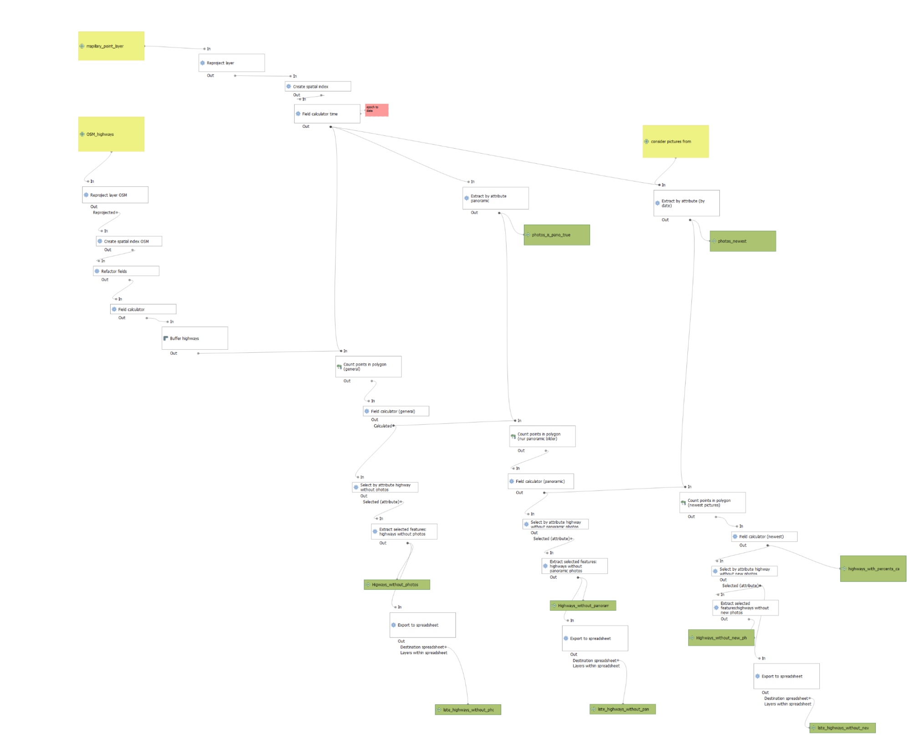
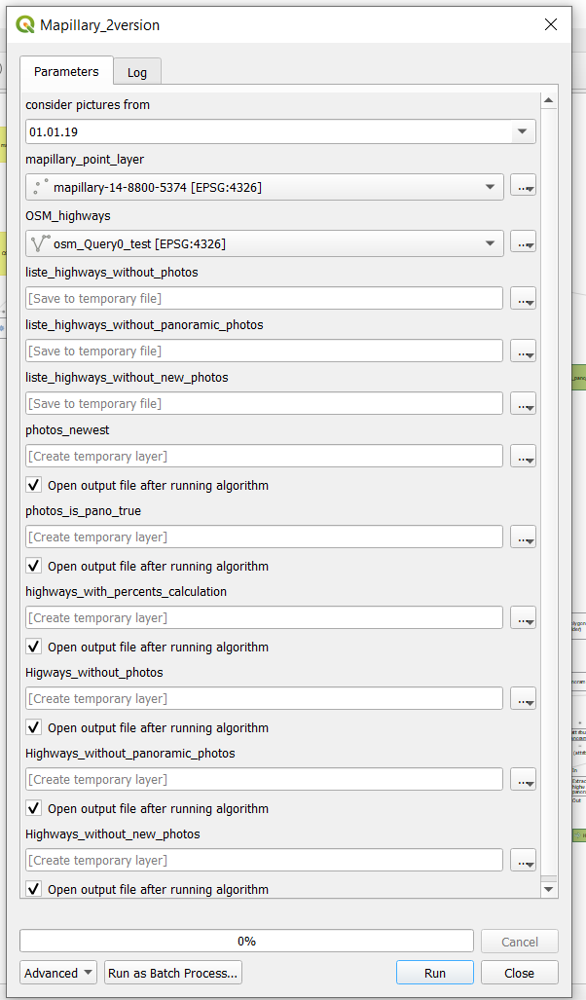
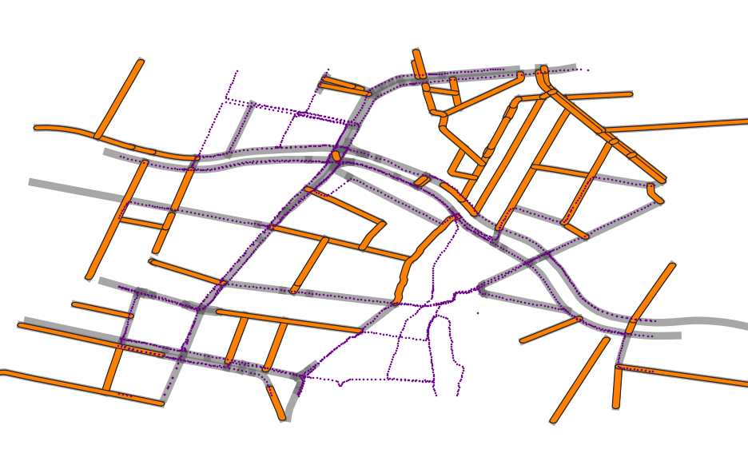
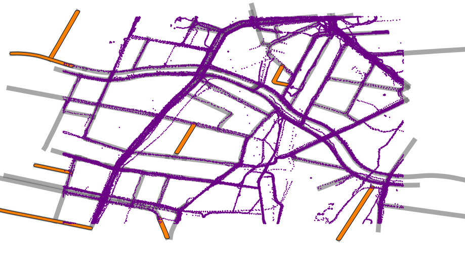
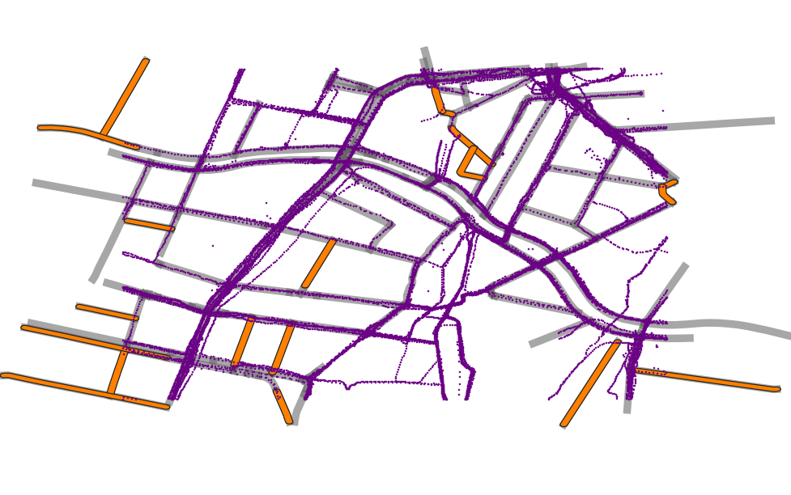

# QGIS Modellbeschreibung

Für das Modell sind 3 Eingaben nötig: 2 Datensätze

1. OSM-Highways (Linien Layer), siehe Overpass-Query unten
1. Mapillary Bilder-Location (Punkt Layer), siehe [`./1-prepare-data`](./1-prepare-data)
1. das gewünschtes Datum

Mit verschiedenen Werkzeuge wird die Anzahl der Bilder pro OSM-Abschnitt gezählt um zu identifizieren, welche OSM-Abschnitten (Highways) noch:

* keine Fotos haben, oder
* keine panoramische Fotos haben, oder
* keine aktuellen Bilder haben.

Die Ergebnisse sind 3 Tabellen (Spreadsheets), wo die OSM-Highways-IDs gelistet sind.

Zur Visualisierungshilfe sind auch die Abschnitte als Geometrie-Layer als Ergebnisse zu finden. Dazu die Mapillary-Bilder-Standorte kategorisiert: z.B: Bilder, die neu als 01.01.2019 sind, und OSM-Abschnitte, die keine (oder nicht genug) aktuelle Bilder haben.

Die Prozent wurde berechnet, weil Bilder die im Knotenpunkte liegen, wurden zu 2 oder mehrere OSM-Highways zugeordnet und führte zu eine nicht repräsentative Ergebnis.

**Model-Design:**

Siehe auch [gqis-model-chart.pdf](./qgis-model-chart.pdf)



**Model-Eingabe-Fenster:**



**Ergebnisse:**

**OSM-Highways ohne Panoramische-Bilder:**



- Grau: OSM-Highways
- Lila Punkte: Panoramische Mapillary Bilder
- Orange: OSM-Highways ohne Panoramische-Bilder

**OSM-Highways ohne aktuelle-Bilder:**



- Grau: OSM-Highways
- Lila Punkte: aktuell Mapillary Bilder (ab 01.01.2019)
- Orange: OSM-Highways ohne aktuelle-Bilder

**OSM-Highways ohne Bilder:**



- Grau: OSM-Highways
- Lila Punkte: Mapillary Bilder
- Orange: OSM-Highways ohne Bilder

## Overpass Abfrage für Schritt 1

```js
[out:xml] [timeout:25];
(
  way["highway"="primary"]({{bbox}});
  way["highway"="primary_link"]({{bbox}});
  way["highway"="secondary"]({{bbox}});
  way["highway"="secondary_link"]({{bbox}});
  way["highway"="tertiary"]({{bbox}});
  way["highway"="path"]({{bbox}});
  way["highway"="service"]({{bbox}});
  way["highway"="tertiary_link"]({{bbox}});
  way["highway"="living_street"]({{bbox}});
  way["highway"="residential"]({{bbox}});
  way["highway"="motorway"]({{bbox}});
  way["highway"="motorway_link"]({{bbox}});
);
(._;>;);
out body;
```
